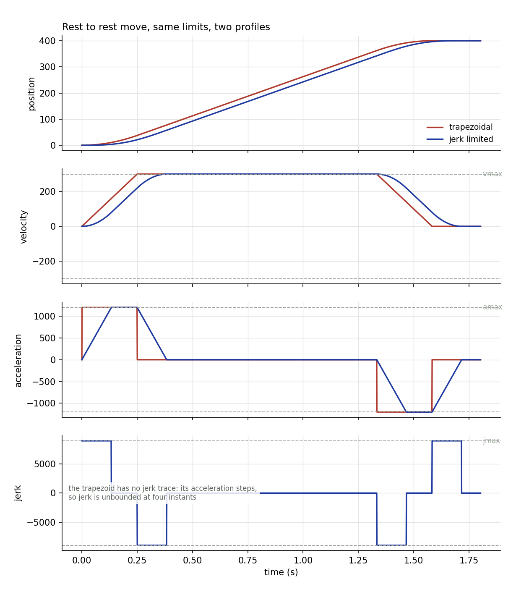

# profile

Rest-to-rest motion profiles for a single axis. C++17 core, Python plotter.



## Two generators.

**Trapezoidal.** Ramp up at `amax`, cruise at `vmax`, ramp down.
Acceleration steps instantly, so jerk is unbounded at four instants in the
move. Nearly every hobby motion library does this, and it is why cheap
gantries ring after every move: the step in acceleration is a broadband
input that hits the first structural mode of the machine.

**Double-S, jerk limited.** Acceleration itself ramps at `jmax`, so jerk
stays bounded. Seven segments: jerk up, hold `amax`, jerk down, cruise, and
the mirror image on the way down.

On a 400 unit move at `vmax` 300, `amax` 1200, `jmax` 9000, the jerk-limited
profile takes 1.717 s against the trapezoid's 1.583 s. That is 8.4 percent
slower on paper, and settles far faster in reality.

## The cases that break naive implementations

Both generators handle all of them:

- the move is too short to reach `vmax`, so the cruise phase disappears
- the move is too short to reach `amax` either, so acceleration becomes a
  pure triangle and the peak never touches the limit
- the move runs in the negative direction

The double-S planner works these out in closed form rather than searching.
The key identity is that a symmetric ramp from rest to `v` covers exactly
`v * Ta / 2` whatever shape the acceleration takes, because velocity is
antisymmetric about `v/2` across the phase. That turns the no-cruise case
into a quadratic in `v`, and the no-`amax` case into a cube root.

## Build and run

```
make test                # 13 checks
make plot                # writes move.csv and move.png
./profile --csv --distance 5 --vmax 300 --amax 1200 --jmax 9000 > short.csv
```

## Implementation note

A profile is stored as a list of constant-jerk segments. Sampling
integrates a cubic exactly, so there is no accumulated error no matter how
finely you sample, and the same evaluator serves every case.

## Tests

Thirteen checks: exact landing on target for both generators, every limit
respected, the profile ending at rest with zero acceleration, the short-move
and very-short-move collapses, negative direction, the time penalty staying
inside a sane bound, and numerically integrating velocity over 200,000 steps
to reproduce the commanded position to within 1e-4.
